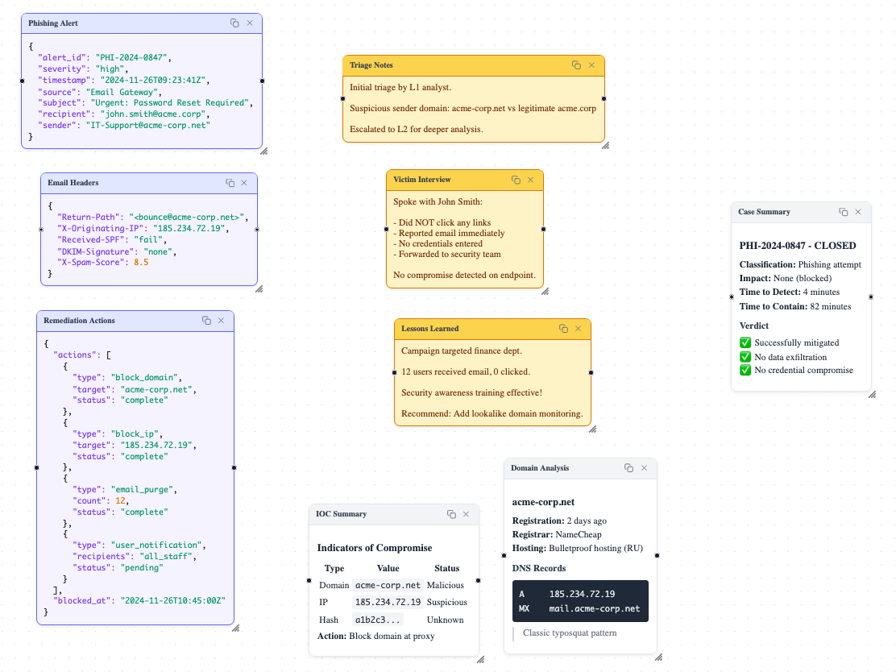
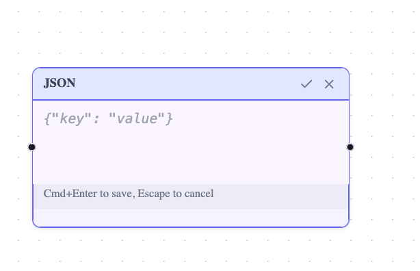
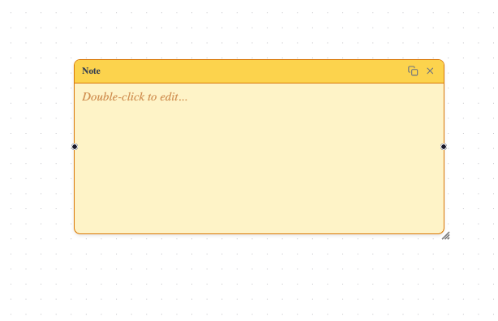
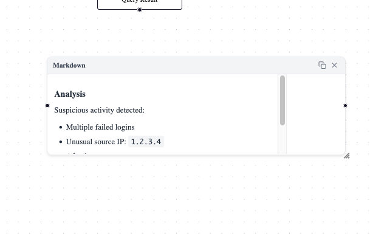

# 2025-11-26 - Canvas & Node Foundations

After settling on Tauri + Svelte + SvelteFlow in the ADR, I worked on canvas bits.

## Node Types

Created three custom node types, all extending a shared `BaseNode` component:

**Note** - Simple text notes with a warm yellow theme. Good for quick observations and analyst commentary.

**Markdown** - Full markdown support with rendered preview. Tables, code blocks, headers - the works. Uses `marked` for rendering.

**JSON** - Syntax-highlighted JSON display with validation. Shows parse errors inline during editing.



## BaseNode Features

The shared `BaseNode` handles all the common stuff:
- Double-click to edit, Cmd+Enter to save, Escape to cancel
- Editable titles (stored in node data)
- Delete and duplicate buttons
- Selection highlighting (blue border + glow)
- Resizable via SvelteFlow's `NodeResizer` and `NodeResizeControl`



## Resize Implementation

Went through a few iterations on resize. Started with a custom implementation but hit zoom-level issues. Switched to SvelteFlow's built-in components:
- `NodeResizer` shows full resize controls when selected
- `NodeResizeControl` shows a subtle gripper when not selected

The gripper ended up slightly outside the node corner which actually looks quite nice - keeping that.



## CodeMirror Integration

Added CodeMirror 6 for editing JSON and Markdown nodes. Gets me:
- Auto-closing brackets and quotes
- Bracket matching
- Syntax highlighting while typing
- Proper undo/redo within the editor (separate from canvas undo)

The editor undo vs canvas undo was causing conflicts - fixed by locking canvas undo while a node is being edited.

## Undo/Redo System

Built a command-based history system:
- `execute()` - run command and add to history
- `record()` - add to history without executing (for actions that already happened like drag)
- Full undo/redo with descriptions shown in toolbar tooltips

> Might end up replacing this with something a bit more ergonomic (?), maybe cause it's been ages since I've done svelte or webish bits adding in the execute and records was a faff.

## Awareness Overlay

Added debug visualization for the "awareness" concept - shows expanded bounding boxes around nodes. When awareness zones overlap, they highlight in yellow. Toggle in toolbar.

This'll be the foundation for context propagation between nearby nodes. Still whiteboarding how that'll work but proximity and context inheretence feels like something that's going to lead to interesting emergent functionality and stuff. Keen to test out the idea of reusable nodes and node positions as a way of populating 'playbook' with specific context.

# Issues Hit

**Scrollbar positioning** - Content had max-width constraints so scrollbars appeared at content edge not node edge. Fixed by removing the constraints since nodes are resizable now.



**Title undo not working** - Was merging data on undo instead of replacing. Titles added during edit weren't being removed on undo because the merge kept them.

# File Structure

```
src/lib/
├── components/
│   ├── AwarenessOverlay.svelte
│   └── CodeMirrorEditor.svelte
├── nodes/
│   ├── BaseNode.svelte
│   ├── JsonNode.svelte
│   ├── MarkdownNode.svelte
│   └── NoteNode.svelte
├── stores/
│   ├── canvas-context.ts
│   ├── commands.ts
│   └── history.ts
└── utils/
    └── awareness.ts
```

# Next Up

- Actually wire up the awareness/context sharing between overlapping nodes
- Think about what "context" means for each node type
- Maybe add edges back for explicit relationships
- Persistence (save/load canvas state)
